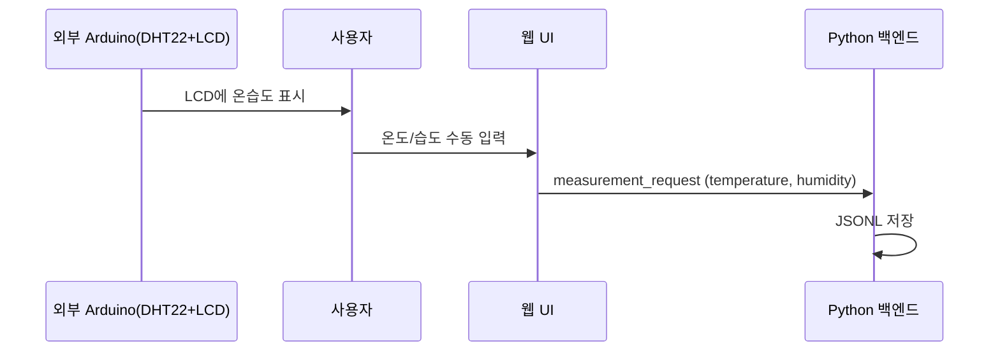

# 3단계: Python 백엔드 작성

이 문서는 Arduino Bridge를 통해 센서 값을 읽고 웹 클라이언트에 전송하는 Python 백엔드를 작성하는 방법을 설명합니다.  
외부 DHT22 보드의 온습도 값은 **웹 수동 입력**으로 백엔드에 전달됩니다.

## 목표

- Arduino Bridge를 통해 거리 값과 조도 값을 읽기
- WebSocket을 사용하여 웹 클라이언트에 실시간으로 센서 값 전송
- 주기적으로 센서 값을 업데이트
- 수동 입력된 온도/습도 값을 측정 요청에 포함하여 저장

## Arduino Bridge란?

Arduino Bridge는 Python 백엔드와 Arduino 스케치 간의 통신을 가능하게 하는 메커니즘입니다:

- **Bridge.provide()**: Arduino에서 Python으로 함수 제공
- **Bridge.call()**: Python에서 Arduino 함수 호출
- 양방향 통신 지원

## 외부 온습도 보드 데이터 흐름

외부 Arduino 보드는 DHT22를 읽어 LCD에 표시합니다.  
사용자는 LCD 값을 보고 **웹 수동 입력 폼**에 온도/습도를 입력합니다.



## Python 백엔드 코드 작성

**파일 위치:** `black-ice-detector/python/main.py`

### 전체 코드

```python
# SPDX-FileCopyrightText: Copyright (C) ARDUINO SRL (http://www.arduino.cc)
#
# SPDX-License-Identifier: MPL-2.0

from arduino.app_utils import *
from arduino.app_bricks.web_ui import WebUI
import time
from datetime import datetime, UTC

# Initialize WebUI
ui = WebUI()

# Distance measurement settings
UPDATE_INTERVAL = 0.1  # Update every 100ms (10 readings per second)
last_update_time = 0.0

print("Python backend starting...")
print("WebUI initialized")

def get_sensor_data():
    """Get duration, distance_mm, and ldr_value from Arduino sensor via Bridge"""
    try:
        # Bridge.call() with shorter timeout (1 second - 더 빠른 응답)
        duration = Bridge.call("get_duration", timeout=1)
        distance_mm = Bridge.call("get_distance_mm", timeout=1)
        ldr_value = Bridge.call("get_ldr_value", timeout=1)
        
        if duration is not None and distance_mm is not None and ldr_value is not None:
            return {
                "duration": int(duration),
                "distance_mm": float(distance_mm),
                "ldr_value": int(ldr_value)
            }
        else:
            # 조용히 처리 (로그 스팸 방지)
            return None
    except TimeoutError:
        # Bridge 통신 타임아웃 - 조용히 처리
        return None
    except Exception as e:
        # 심각한 오류만 출력
        print(f"❌ Error reading sensor data: {e}")
        return None


def send_distance_update():
    """Send distance update to all connected clients"""
    global last_update_time
    
    current_time = time.time()
    
    # Check if enough time has passed since last update
    if current_time - last_update_time >= UPDATE_INTERVAL:
        sensor_data = get_sensor_data()
        
        # Always send message, even if sensor data is invalid
        if sensor_data is not None:
            # Prepare message with distance, duration, distance_mm, ldr_value
            distance_mm = sensor_data["distance_mm"]
            distance_cm = distance_mm / 10.0  # mm to cm
            message = {
                "distance": distance_cm,
                "duration": sensor_data["duration"],
                "distance_mm": distance_mm,
                "ldr_value": sensor_data["ldr_value"],
                "timestamp": datetime.now(UTC).isoformat(),
                "unit": "cm",
                "valid": distance_cm > 0 and sensor_data["duration"] > 0
            }
            
            # Send to all connected clients
            ui.send_message("distance_update", message)
        else:
            # Send error message if sensor reading failed
            message = {
                "distance": -1.0,
                "duration": -1,
                "distance_mm": -1.0,
                "ldr_value": -1,
                "timestamp": datetime.now(UTC).isoformat(),
                "unit": "cm",
                "valid": False
            }
            ui.send_message("distance_update", message)
        
        last_update_time = current_time

def on_client_connected(client_id, data):
    """Send initial distance reading when client connects"""
    print(f"Client connected: {client_id}")
    sensor_data = get_sensor_data()
    if sensor_data is not None:
        distance_mm = sensor_data["distance_mm"]
        distance_cm = distance_mm / 10.0  # mm to cm
        message = {
            "distance": distance_cm,
            "duration": sensor_data["duration"],
            "distance_mm": distance_mm,
            "ldr_value": sensor_data["ldr_value"],
            "timestamp": datetime.now(UTC).isoformat(),
            "unit": "cm",
            "valid": distance_cm > 0 and sensor_data["duration"] > 0
        }
        ui.send_message("distance_update", message)
        print(f"Sent initial distance: {distance_cm:.2f} cm ({distance_mm:.2f} mm), Duration: {sensor_data['duration']} us")
    else:
        # Even if sensor reading fails, send -1 to show connection is working
        message = {
            "distance": -1.0,
            "duration": -1,
            "distance_mm": -1.0,
            "ldr_value": -1,
            "timestamp": datetime.now(UTC).isoformat(),
            "unit": "cm",
            "valid": False
        }
        ui.send_message("distance_update", message)
        print("Sent initial message (sensor reading failed)")

# Register WebSocket event handlers
ui.on_message("client_connected", on_client_connected)

# Main application loop
def main_loop():
    """Main loop to continuously send distance updates"""
    print("✅ Main loop started")
    loop_count = 0
    while True:
        try:
            send_distance_update()
            loop_count += 1
            # Print status every 50 loops (about every 2.5 seconds)
            if loop_count % 50 == 0:
                print(f"🔄 Main loop running... (loop {loop_count}, {loop_count * 0.1:.1f}s elapsed)")
            time.sleep(0.05)  # Small delay to prevent CPU overload
        except Exception as e:
            print(f"❌ Error in main loop: {e}")
            import traceback
            traceback.print_exc()
            time.sleep(0.1)  # Wait a bit before retrying

# Run the app with custom loop
print("Starting App.run()...")
App.run(user_loop=main_loop)
```

## 코드 설명

### 1. 라이브러리 임포트

```python
from arduino.app_utils import *
from arduino.app_bricks.web_ui import WebUI
import time
from datetime import datetime, UTC
```

- `arduino.app_utils`: Arduino App Lab의 유틸리티 함수
- `arduino.app_bricks.web_ui`: WebSocket 통신을 위한 WebUI Brick
- `time`: 시간 관련 함수
- `datetime`: 타임스탬프 생성

### 2. WebUI 초기화

```python
ui = WebUI()
```

- WebSocket 서버를 생성하여 웹 클라이언트와 실시간 통신

### 3. 센서 값 읽기 함수

```python
def get_sensor_data():
    """Get duration, distance_mm, and ldr_value from Arduino sensor via Bridge"""
    try:
        duration = Bridge.call("get_duration", timeout=1)
        distance_mm = Bridge.call("get_distance_mm", timeout=1)
        ldr_value = Bridge.call("get_ldr_value", timeout=1)
        
        if duration is not None and distance_mm is not None and ldr_value is not None:
            return {
                "duration": int(duration),
                "distance_mm": float(distance_mm),
                "ldr_value": int(ldr_value)
            }
        else:
            return None
    except TimeoutError:
        return None
    except Exception as e:
        print(f"❌ Error reading sensor data: {e}")
        return None
```

**동작 과정:**
1. `Bridge.call("get_duration")`: Arduino의 `get_duration()` 함수 호출
2. `Bridge.call("get_distance_mm")`: Arduino의 `get_distance_mm()` 함수 호출
3. `Bridge.call("get_ldr_value")`: Arduino의 `get_ldr_value()` 함수 호출
4. 모든 값이 정상적으로 읽히면 딕셔너리로 반환
5. 예외 처리: 오류 발생 시 None 반환

### 4. 센서 값 전송 함수

```python
def send_distance_update():
    """Send distance update to all connected clients"""
    global last_update_time
    
    current_time = time.time()
    
    # Check if enough time has passed since last update
    if current_time - last_update_time >= UPDATE_INTERVAL:
        sensor_data = get_sensor_data()
        
        if sensor_data is not None:
            distance_mm = sensor_data["distance_mm"]
            distance_cm = distance_mm / 10.0  # mm to cm
            message = {
                "distance": distance_cm,
                "duration": sensor_data["duration"],
                "distance_mm": distance_mm,
                "ldr_value": sensor_data["ldr_value"],
                "timestamp": datetime.now(UTC).isoformat(),
                "unit": "cm",
                "valid": distance_cm > 0 and sensor_data["duration"] > 0
            }
            
            ui.send_message("distance_update", message)
        else:
            # Send error message if sensor reading failed
            message = {
                "distance": -1.0,
                "duration": -1,
                "distance_mm": -1.0,
                "ldr_value": -1,
                "timestamp": datetime.now(UTC).isoformat(),
                "unit": "cm",
                "valid": False
            }
            ui.send_message("distance_update", message)
        
        last_update_time = current_time
```

**동작 과정:**
1. **업데이트 주기 확인**: `UPDATE_INTERVAL` (0.1초)마다 실행
2. **센서 값 읽기**: Bridge를 통해 Arduino에서 센서 값 읽기
3. **메시지 생성**: 거리, duration, 조도 값, 타임스탬프, 단위, 유효성 포함
4. **전송**: `ui.send_message()`로 모든 연결된 클라이언트에 전송

### 5. 클라이언트 연결 핸들러

```python
def on_client_connected(client_id, data):
    """Send initial distance reading when client connects"""
    print(f"Client connected: {client_id}")
    sensor_data = get_sensor_data()
    if sensor_data is not None:
        # ... 메시지 생성 및 전송
    else:
        # 오류 메시지 전송
```

- 새 클라이언트가 연결되면 즉시 현재 센서 값을 전송

### 6. 메인 루프

```python
def main_loop():
    """Main loop to continuously send distance updates"""
    print("✅ Main loop started")
    loop_count = 0
    while True:
        try:
            send_distance_update()
            loop_count += 1
            if loop_count % 50 == 0:
                print(f"🔄 Main loop running... (loop {loop_count})")
            time.sleep(0.05)  # Small delay to prevent CPU overload
        except Exception as e:
            print(f"❌ Error in main loop: {e}")
            time.sleep(0.1)

App.run(user_loop=main_loop)
```

- `App.run(user_loop=main_loop)`: 사용자 정의 루프로 앱 실행
- 0.05초마다 센서 업데이트 함수 호출

## WebSocket 메시지 형식

웹 클라이언트로 전송되는 메시지 형식:

```json
{
    "distance": 25.5,
    "duration": 1457,
    "distance_mm": 255.0,
    "ldr_value": 512,
    "timestamp": "2025-01-20T10:30:45.123456+00:00",
    "unit": "cm",
    "valid": true
}
```

### 측정 요청 메시지 (수동 입력 포함)

```json
{
    "temperature": 26.4,
    "humidity": 17.2,
    "location": 101,
    "black_ice_status": "occurred"
}
```

**필드 설명:**
- `distance`: 측정된 거리 값 (cm)
- `duration`: 펄스 지속 시간 (마이크로초)
- `distance_mm`: 측정된 거리 값 (mm)
- `ldr_value`: 조도 센서 값 (0~1023)
- `timestamp`: 측정 시간 (ISO 8601 형식)
- `unit`: 거리 단위 ("cm")
- `valid`: 유효한 측정인지 여부 (true/false)

## 측정 결과 저장(JSONL)에 포함되는 온습도

수동 입력된 온도/습도는 결과 레코드에 포함됩니다:

```json
{
    "temperature": 27.1,
    "humidity": 24.4,
    "location": 3,
    "black_ice_status": "occurred"
}
```

## 커스터마이징

### 업데이트 주기 변경

더 빠른 업데이트를 원하면:

```python
UPDATE_INTERVAL = 0.05  # 50ms (20 readings per second)
```

더 느린 업데이트를 원하면:

```python
UPDATE_INTERVAL = 0.5  # 500ms (2 readings per second)
```

### 메시지 형식 변경

추가 정보를 포함하려면:

```python
message = {
    "distance": distance_cm,
    "ldr_value": sensor_data["ldr_value"],
    "timestamp": datetime.now(UTC).isoformat(),
    "unit": "cm",
    "valid": distance_cm > 0,
    "sensor_id": "HC-SR04",  # 추가 필드
    "temperature": 20.0       # 추가 필드
}
```

## 디버깅

### 콘솔 출력 확인

Arduino App Lab의 콘솔에서 다음 메시지를 확인할 수 있습니다:

```
Python backend starting...
WebUI initialized
✅ Main loop started
Client connected: abc123
Sent initial distance: 25.50 cm (255.0 mm), Duration: 1457 us
🔄 Main loop running... (loop 50, 5.0s elapsed)
```

### Bridge 통신 오류 처리

Bridge 통신이 실패하는 경우:

```python
def get_sensor_data():
    try:
        duration = Bridge.call("get_duration", timeout=1)
        if duration is None:
            print("Warning: Bridge returned None")
            return None
        # ...
    except Exception as e:
        print(f"Error reading sensor data: {e}")
        import traceback
        traceback.print_exc()  # 상세한 오류 정보 출력
        return None
```

## 문제 해결

### Bridge.call()이 None을 반환함

**원인:**
- Arduino 스케치가 업로드되지 않음
- Bridge.provide()가 제대로 설정되지 않음
- 함수 이름 불일치

**해결:**
1. Arduino 스케치 업로드 확인
2. 시리얼 모니터에서 센서 값이 출력되는지 확인
3. Bridge.provide() 코드 확인:
   - `Bridge.provide("get_duration", get_duration)`
   - `Bridge.provide("get_distance_mm", get_distance_mm)`
   - `Bridge.provide("get_ldr_value", get_ldr_value)`
4. Bridge.call() 함수 이름 확인

### WebSocket 연결 오류

**원인:**
- WebUI Brick이 제대로 초기화되지 않음
- 포트 충돌

**해결:**
1. app.yaml에 `web_ui` Brick이 포함되어 있는지 확인
2. 다른 앱이 같은 포트를 사용하고 있는지 확인

### 업데이트가 너무 느림/빠름

**해결:**
- `UPDATE_INTERVAL` 값을 조정
- `main_loop()`의 `time.sleep()` 값 조정

## 다음 단계

Python 백엔드가 완성되었으므로 다음 단계로 진행합니다:

- [4단계: 웹 인터페이스 작성](04-웹-인터페이스-작성.md) - HTML, CSS, JavaScript로 UI 구현

## 체크리스트

- [ ] Python 백엔드 코드 작성 완료
- [ ] Bridge 통신 함수 구현 완료 (get_duration, get_distance_mm, get_ldr_value)
- [ ] WebSocket 메시지 전송 구현 완료
- [ ] 업데이트 루프 구현 완료
- [ ] 콘솔에서 센서 값 출력 확인 완료
